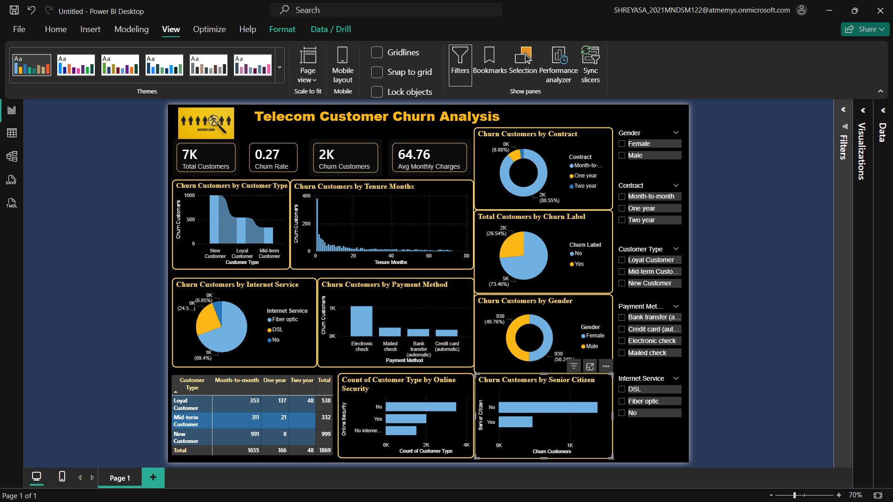

# Telecom Customer Churn Analysis Dashboard

## Project Overview

This project uses **Power BI** to analyze customer churn in a telecommunications company and identify customer segments and services associated with higher churn.

The dashboard provides an interactive view of **7K+ customers**, focusing on churn rate, customer type, contract type, tenure, internet service, payment method, gender, online security, and senior-citizen status.

## Project Objective

The main objective of this project is to:

* Analyze customer churn patterns
* Identify customer segments with higher churn
* Understand the relationship between churn and contract type
* Analyze churn based on customer tenure
* Compare churn across different services and payment methods
* Provide business insights that can help improve customer retention

## Tools & Technologies

* **Power BI Desktop**
* **Power Query Editor**
* **DAX**
* **Data Visualization**
* **Data Cleaning & Transformation**

## Dataset

The project uses the **Telco Customer Churn** dataset.

The dataset contains information about:

* Customer demographics
* Contract details
* Tenure
* Monthly and total charges
* Internet services
* Payment methods
* Online security and other services
* Customer churn status

The main target field is **Churn**, which indicates whether a customer has left the telecom service.

## Data Preparation

Data cleaning and transformation were performed using **Power Query Editor**.

Key preparation steps included:

* Checking and correcting data types
* Cleaning the dataset
* Handling missing/blank values
* Preparing numerical and categorical fields
* Creating a custom **Customer Type** column based on customer tenure

### Customer Type Segmentation

Customers were categorized into:

* **New Customer**
* **Mid-term Customer**
* **Loyal Customer**

This segmentation was used to analyze churn across different stages of the customer lifecycle.

## Key KPIs

The dashboard includes the following key performance indicators:

* **Total Customers**
* **Churn Rate**
* **Churn Customers**
* **Average Monthly Charges**

## Dashboard Analysis

The dashboard contains several interactive visualizations:

### Customer Churn by Customer Type

Analyzes churn across New, Mid-term, and Loyal customers.

### Churn by Contract

Compares churn across:

* Month-to-month
* One year
* Two year

### Churn by Tenure

Shows how churn varies according to the number of months customers have been with the company.

### Churn by Internet Service

Compares churn across:

* DSL
* Fiber optic
* No internet service

### Churn by Payment Method

Analyzes churn across different payment methods.

### Churn by Gender

Compares churn between male and female customers.

### Churn by Online Security

Examines the relationship between online security services and customer churn.

### Churn by Senior Citizen

Compares churn behavior between senior and non-senior customers.

### Customer Type vs Contract

A matrix visual combines **Customer Type** and **Contract** to identify specific customer segments with higher churn.

## Key Insights

The dashboard helps identify patterns such as:

* Customers with **month-to-month contracts** represent a significant portion of churn.
* **New customers** form an important high-churn segment.
* Customers with **shorter tenure** show higher churn concentration.
* Churn varies across different **internet service and payment methods**.
* Customer segmentation helps identify groups that may require stronger retention strategies.

## Dashboard Preview

## Business Value

The analysis can help a telecom company:

* Identify high-risk customer segments
* Improve customer retention strategies
* Understand customer behavior
* Evaluate contract and service-related churn
* Develop targeted retention campaigns

## Future Improvements

Possible future enhancements include:

* Customer churn prediction using Machine Learning
* Customer risk scoring
* Advanced DAX measures
* Drill-through customer analysis
* Cohort analysis
* Automated data refresh
* Integration of Power BI with a predictive ML model

## Project Summary

**Telecom Customer Churn Analysis Dashboard**
*Built an interactive Power BI dashboard to analyze customer churn, segmentation, contract patterns, tenure, services, and payment behavior using Power Query and DAX.*

